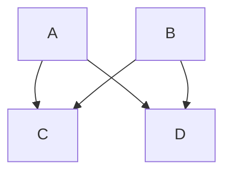

# H1 header

## H2 header

### H3 header

Paragraph text.

> Block quote.
>
> Multi-line block quote.

- List item 1
- List item 2
  - Nested list item 1

1. Numbered item 1
2. Numbered item 2
   1. Nested numbered item
      1. Even more nested

**Bold**, _italics_ **_and both_**.

Separator

---

Line

```ts
console.log('Hello typescript!');
```

```python
print('hello python')
```

| test  | test2 |
| ----- | ----- |
| table | table |


